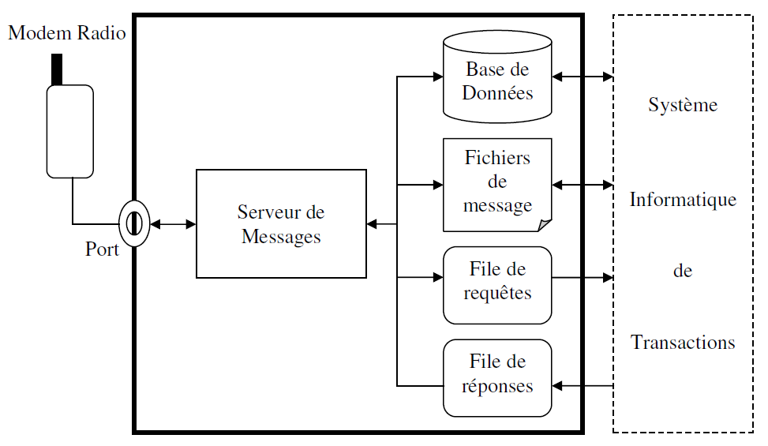
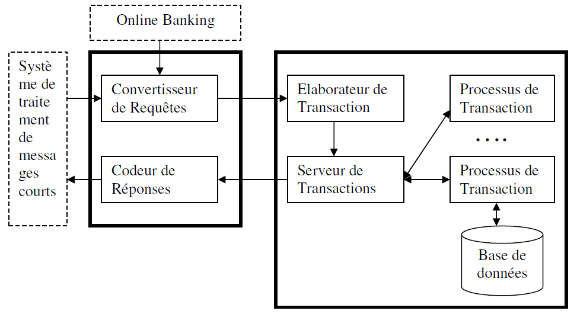

# Peer-2-Peer Mobile Money Platform using SMS and simple phones

This platform requires a GSM device connected on serial port. It receives and decodes SMS containing with payment instructions.  No internet needed.

Any participant can registered and perform transactions with others. 

Participant can add money to their account using voucher codes, which are previously arranged and uploaded in the system.

Example messages:

* `REG 1` to register the sender as new participant
* `0000 CHAN 1234` to change the default 0000 PIN to 1234
* `1234 CHAR 2654578745467654` to add money to the participant's account with the amount corresponding to the voucher ID 2654578745467654
* `1234 TRANS 678976789 7500` to transfer money value 7500,- to a recipient with phone number 678976789
* `1234 QUES` to view account balance

The platform maintains a database of participants, accounts and balance.

